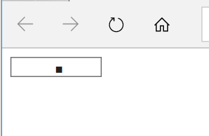

# ie-placeholder-issue-demo
Reproducible example for an issue with placeholder-attribute in IE &amp; Edge

This repository contains:
- Files to build a very simple TTF font (build.js, dev dependencies)
- The TTF font that was built (dist/testfont.ttf). The font only contains a glyph for one character: Space (U+0020)
- A simple demo "website" that can be opened in the browser (index.html, index.css)

## How to test:
1. Clone this repository
2. Open index.html in the browser

### Expected result:
In IE and Edge, the input field in this demo page will display one "box" character as a placeholder.  
In Chrome and Firefox, the input field in this demo page is empty.




## Counterexample:
To verify that the character in question is the Space character and there's not just some weird
stuff happening with the custom font being applied, you can generate a "counterexample" font that
contains bunch of other unicode characters, but not the space character.

To do so, create the TTF font with this command (requires Node and npm to be installed and in PATH):

```
npm i
npm run build:counterexample
```

Then, reopen index.html in browser.  

### Expected result:
The input field in this demo page is empty in all browsers.

**Note:** browsers, especially IE and Edge are very eager to cache the fonts and the state of the
input element. If you don't see the expected outcome, make sure it isn't because of caching.